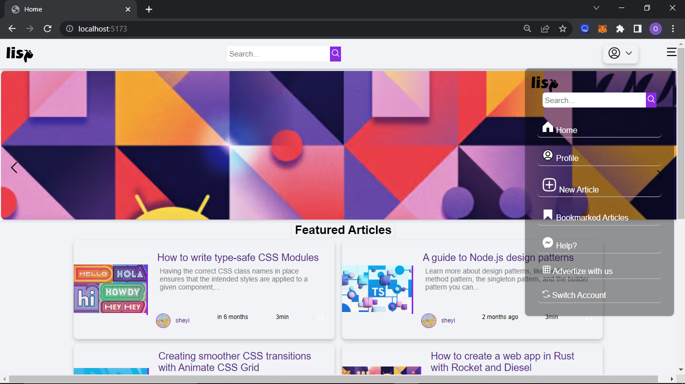

# Lisp

A blog application that allow users to create an account, express their thoughts with words for publication and connect with other writers.


## Prerequisites

Before running Lisp, ensure that you have the following installed:

Node.js (version 12 or higher)

npm (Node Package Manager)

## Installation

To install the required dependencies, run the following command in your terminal:

```bash
npm install 
```

## Configuration
Locate the config.js file in the project and provide all the requirements in your dotenv file
## Running the Program


```bash
npm run dev 

```
## Tech Stack
 - Reactjs
  - Redux
   - Nodejs
  - In memory DB
  - express
  - Jwt
  - Winston
  - Httpcookie 
  - and more...





 


